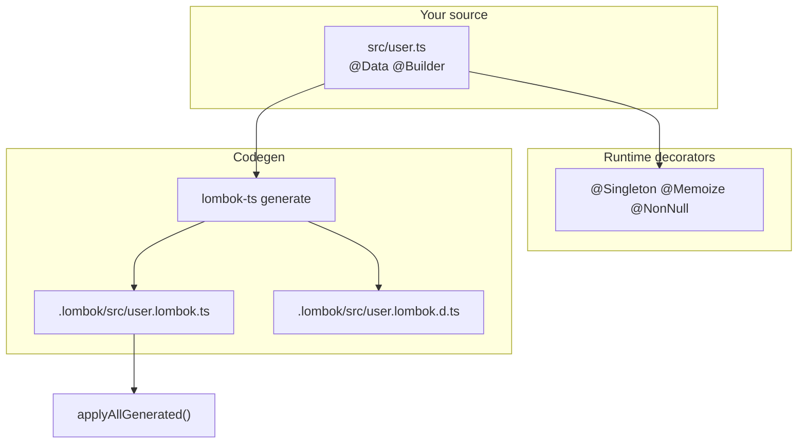

# Introduction

## The problem

TypeScript classes often accumulate repetitive code: getters and setters, `equals` and `toString`, builders, null checks, and singleton wiring. Design-pattern scaffolding (factory registries, memoization) adds more of the same.

Java teams solve much of this with **Project Lombok**. TypeScript has decorators, but no single library that combines Lombok ergonomics with Gang-of-Four patterns and a clear codegen story.

## The solution

**lombok-typescript** provides:

1. **Decorators** you attach to classes, fields, and methods
2. **Runtime behavior** where reflection is enough (`@Singleton`, `@Memoize`, `@NonNull`)
3. **Codegen** where generated methods and types are clearer (`@Data`, `@Builder`, `@ToString`)
4. **A CLI** (`lombok-ts generate`) that writes `.lombok/` companion files next to your sources

## Two decorator standards

| Backend | Import                     | When                                                        |
| ------- | -------------------------- | ----------------------------------------------------------- |
| Legacy  | `lombok-typescript/legacy` | `experimentalDecorators: true` (NestJS, TypeORM)            |
| Stage 3 | `lombok-typescript/stage3` | `experimentalDecorators: false` (TS 5.0+ native decorators) |

The same decorator names work in both backends; pick one per project.

## Next steps

- [Getting started](/guide/getting-started) — install and first generated class
- [Architecture](/guide/architecture) — how runtime and codegen interact
- [Decorator overview](/decorators/overview) — reference for each decorator
