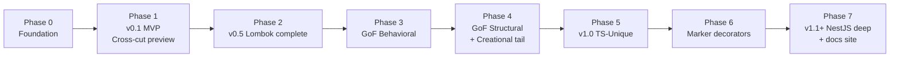

# MVP & Roadmap — `lombok-typescript`

> **Mission:** Ship a public open-source npm package that brings the boilerplate-reducing magic of Java's Project Lombok to TypeScript, plus mechanical decorator implementations of all 23 Gang-of-Four design patterns. Framework-agnostic core, first-class NestJS interop. **Add a decorator, get the pattern.**

This doc is the source of truth for **what ships when**. The full decorator catalog lives in [PATTERNS.md](./PATTERNS.md) and open architectural questions are tracked in [DECISIONS.md](./DECISIONS.md).

---

## 1. Goals

- **Lombok ergonomics:** eliminate getter/setter, builder, toString, equals, etc. boilerplate via decorators
- **GoF patterns as decorators:** ~17 of 23 GoF patterns implemented mechanically; remainder shipped as marker-only annotations (see [PATTERNS.md §3, §4](./PATTERNS.md))
- **Framework-agnostic core:** works in plain TS, NestJS, Express, Fastify, Next.js, Vite, etc.
- **First-class NestJS interop:** zero friction with NestJS DI, modules, lifecycle (see §6)
- **Production-ready:** comprehensive tests, docs site, clear migration paths, semver discipline
- **Educational value:** junior devs should be able to learn each pattern from one decorator + one example

## 2. Non-goals

- Not a DI container (NestJS, Inversify, tsyringe own this space)
- Not a state-management library (Redux, Zustand, MobX own this)
- Not an ORM / data-access library
- Not a runtime polyfill — we target TS ≥5.x and Node ≥18 only
- Not committed to legacy `experimentalDecorators` forever (Stage 3 migration is a v1.x roadmap item — see ADR-01)

## 3. Personas

| Persona | What they want | Top-3 decorators |
|---|---|---|
| **TS app dev** building business logic | Less boilerplate, clean classes | `@Data`, `@Builder`, `@NonNull` |
| **NestJS dev** building services | Pattern decorators that play with `@Injectable` | `@Memoize`, `@Retry`, `@Singleton` (advisory) |
| **TS library author** publishing typed APIs | Immutability, builders, equality | `@Value`, `@With`, `@Builder` |
| **Junior dev** learning patterns | One decorator per GoF pattern with a clean example | `@Singleton`, `@Strategy`, `@Observer` |
| **Migrant from Java/Spring** | Familiar Lombok semantics in TS | `@Data`, `@Log`, `@Builder`, `@UtilityClass` |

---

## 4. Decorator scoring matrix

Sourced from [PATTERNS.md](./PATTERNS.md). Three-axis evaluation guides phase placement.

- **Value** (1-5): user-perceived utility
- **Complexity** (1-5): implementation cost (5 = hardest)
- **Differentiation** (1-5): how much better than what TS gives you out of the box

Higher Value × lower Complexity × higher Differentiation → earlier phase. Ties broken by viability (Real > Helper > Marker-only) and by Persona impact.

| Decorator | Value | Complexity | Differentiation | Viability | Phase |
|---|---|---|---|---|---|
| `@NonNull` | 5 | 1 | 4 | Real | 1 |
| `@ToString` | 4 | 2 | 4 | Real | 1 |
| `@Builder` | 5 | 4 | 5 | Real | 1 |
| `@Data` | 5 | 4 | 5 | Real | 1 |
| `@Singleton` | 4 | 1 | 3 | Real | 1 |
| `@Prototype` | 3 | 1 | 4 | Real | 1 |
| `@Factory` | 4 | 3 | 4 | Real | 1 |
| `@Memoize` | 5 | 2 | 4 | Real | 1 |
| `@Value` | 5 | 4 | 5 | Real | 2 |
| `@With` | 4 | 3 | 5 | Real | 2 |
| `@Equals` | 4 | 3 | 4 | Real | 2 |
| `@Getter` / `@Setter` | 3 | 2 | 3 | Real | 2 |
| `@Log` | 4 | 2 | 3 | Real | 2 |
| `@Accessors` | 3 | 3 | 3 | Real | 2 |
| `@UtilityClass` | 3 | 2 | 4 | Real | 2 |
| `@FieldDefaults` | 2 | 3 | 3 | Real | 2 |
| `@Delegate` | 4 | 4 | 5 | Real | 2 |
| `@Strategy` | 5 | 2 | 4 | Real | 3 |
| `@State` | 4 | 3 | 4 | Real | 3 |
| `@Command` | 3 | 2 | 3 | Real | 3 |
| `@Memento` | 3 | 2 | 4 | Real | 3 |
| `@Observer` / `@Observable` | 4 | 3 | 3 | Real | 3 |
| `@ChainOfResponsibility` | 4 | 3 | 4 | Real | 3 |
| `@Iterable` / `@Iterator` | 3 | 2 | 3 | Real | 3 |
| `@AbstractFactory` | 2 | 4 | 3 | Helper | 4 |
| `@Flyweight` | 3 | 3 | 4 | Real | 4 |
| `@Proxy` | 4 | 4 | 4 | Real | 4 |
| `@Composite` | 3 | 3 | 4 | Real | 4 |
| `@Wraps` (GoF Decorator) | 3 | 4 | 3 | Real | 4 |
| `@TemplateMethod` | 3 | 4 | 4 | Real | 4 |
| `@Visitor` / `@Visitable` | 3 | 5 | 5 | Real | 4 |
| `@Retry` | 5 | 2 | 4 | Real | 5 |
| `@Validate` | 5 | 4 | 3 | Real | 5 |
| `@Debounce` / `@Throttle` | 4 | 2 | 3 | Real | 5 |
| `@Trace` | 4 | 2 | 4 | Real | 5 |
| `@Serializable` | 4 | 4 | 4 | Real | 5 |
| `@DeepFreeze` | 3 | 2 | 4 | Real | 5 |
| `@Adapter` | 1 | 1 | 1 | Marker-only | 6 |
| `@Bridge` | 1 | 1 | 1 | Marker-only | 6 |
| `@Facade` | 1 | 1 | 1 | Marker-only | 6 |
| `@Mediator` | 1 | 1 | 1 | Marker-only | 6 |
| `@Interpreter` | 1 | 1 | 1 | Marker-only | 6 |

---

## 5. Roadmap — 7 phases

### Phase 0 — Foundation

No public release. Unblocks everything downstream.

**Scope:**
- Resolve **ADR-01** (Stage 3 vs `experimentalDecorators`) and **ADR-02** (metadata strategy)
- Build out the decorator base infrastructure under `src/decorators/core/` and `src/decorators/unique/` (currently `.gitkeep` only)
- Implement [src/codegen/analyzer.ts](../src/codegen/analyzer.ts) and [src/codegen/generator.ts](../src/codegen/generator.ts) end-to-end with ts-morph (currently throw "Not implemented")
- Decide **ADR-04** (codegen execution model) and produce a working pipeline
- Fix the broken re-exports in [src/decorators/index.ts](../src/decorators/index.ts) so `pnpm build` and `pnpm test` go green
- Add `LICENSE` (MIT), populate `author` and `repository.url` in [package.json](../package.json), set up CI (GitHub Actions: typecheck, lint, test, build matrix on Node 18/20/22)
- Set up Vitest test scaffolding with at least one passing test per layer (utils, metadata, codegen)
- Confirm npm package name availability (`npm view lombok-typescript`)

**Exit criteria:** green CI; codegen can analyze a single decorated class and emit a generated companion file end-to-end.

### Phase 1 — Public Preview MVP (v0.1)

The smallest cross-cutting set that proves the dual-purpose vision. Ships to npm as `0.1.0` with "preview" tag.

**Decorators (8):**

| Decorator | Why in MVP |
|---|---|
| `@NonNull` | Smallest viable runtime-field decorator — proves the runtime metadata path |
| `@ToString` | Smallest viable codegen-class decorator — proves the codegen pipeline |
| `@Builder` | Highest-value Lombok feature; covers GoF Creational Builder simultaneously |
| `@Data` | Highest-value composite decorator; demonstrates inter-decorator composition |
| `@Singleton` | Smallest viable GoF runtime decorator |
| `@Prototype` | Pairs with `@Singleton`; uses already-built `deepClone` helper |
| `@Factory` | Most-asked GoF Creational pattern; demonstrates registry-based decorators |
| `@Memoize` | Most-loved TS-unique decorator; proves the method-decorator path |

**Ships with:**
- Working `pnpm build` and `pnpm test` with ≥80% coverage on these 8 decorators
- Two example apps under `examples/`:
  - `examples/plain-ts/` — proves framework-agnostic core
  - `examples/nestjs/` — proves NestJS interop (and surfaces any issues early)
- Docs site skeleton (recommend Astro Starlight or VitePress)
- `CHANGELOG.md`, `CONTRIBUTING.md`, `LICENSE`, populated `package.json`
- npm publish workflow (GitHub Actions on tag push)
- README rewrite reflecting both Lombok and GoF positioning

**Exit criteria:** v0.1.0 published to npm, all 8 decorators documented with runnable examples, NestJS example app demonstrates `@Memoize`, `@Singleton`, and `@Factory` working alongside `@Injectable()`.

### Phase 2 — Lombok core complete (v0.5)

Round out Tier 1 + Tier 2 from [FEATURES.md](./FEATURES.md). Full Lombok parity story.

**Decorators (9):** `@Value`, `@With`, `@Equals`, `@Getter` / `@Setter`, `@Log`, `@Accessors`, `@UtilityClass`, `@FieldDefaults`, `@Delegate`

**Notable challenges:**
- `@Data` × `@Value` conflict resolution (ADR-07)
- `@Log` backend resolution (ADR-09)
- `@Delegate` introspecting field types via ts-morph

**Exit criteria:** v0.5.0 published; complete data-class story; migration guide section "From Java Lombok" published.

### Phase 3 — GoF Behavioral (high-value subset)

Prioritize the patterns developers reach for daily.

**Decorators (7):** `@Strategy`, `@State`, `@Command`, `@Memento`, `@Observer` / `@Observable`, `@ChainOfResponsibility`, `@Iterable` / `@Iterator`

**Notable challenges:**
- `@State` transition validation (codegen vs runtime errors)
- `@Observer` integration with reactive ecosystems (RxJS, MobX) — likely opt-in adapters

**Exit criteria:** v0.7.0 published; 7 most-used GoF Behavioral patterns shipped Real.

### Phase 4 — GoF Structural & Creational completion

**Decorators (7):** `@AbstractFactory`, `@Flyweight`, `@Proxy`, `@Composite`, `@Wraps`, `@TemplateMethod`, `@Visitor` / `@Visitable`

**Notable challenges:**
- `@Wraps` naming and its relationship to TS decorator syntax (ADR-15) — must not confuse new users
- `@Visitor` is the highest-complexity decorator; double-dispatch codegen needs careful API design

**Exit criteria:** v0.9.0 published; all mechanically-automatable GoF patterns shipped.

### Phase 5 — TypeScript-unique decorators (v1.0)

The remaining items from FEATURES.md Tier 3, completing the "more than Lombok" story.

**Decorators (6):** `@Retry`, `@Validate`, `@Debounce` / `@Throttle`, `@Trace`, `@Serializable`, `@DeepFreeze`

**Notable challenges:**
- `@Validate` adapter contract for Zod / Yup / class-validator (ADR-10)
- `@Trace` sensitive-arg redaction
- `@Serializable` circular reference handling

**Exit criteria:** **v1.0.0 published.** Stable API. Full docs site. Public announcement (HN, Reddit r/typescript, dev.to).

### Phase 6 — Marker / advisory decorators

Low-cost completion of GoF coverage. These don't generate code; they document intent and provide TypeScript typing aids.

**Decorators (5):** `@Adapter`, `@Bridge`, `@Facade`, `@Mediator`, `@Interpreter`

**Why ship them:**
- Honest GoF coverage — having "all 23" is a marketing/educational story
- Typing aids (e.g. `@Adapter({ adapts: X, target: Y })` validates structural compatibility)
- Documentation for future contributors who might find a way to make them Real

**Exit criteria:** v1.1.0 published; "all 23 GoF patterns" tagline now technically accurate.

### Phase 7 — NestJS deep integration & community ramp (v1.x ongoing)

Beyond pattern parity. Make it the obvious choice for NestJS shops.

**Scope:**
- Dedicated `@lombok-typescript/nestjs` satellite package (per ADR-14) with NestJS-specific bindings: dynamic modules, lifecycle hook integration, `@Injectable()` × `@Singleton`/`@Memoize` interop helpers
- Plugin API allowing community-contributed decorators
- Object Pool decorator (`@Pool`) — the "24th GoF" candidate from ADR-16
- Migration guide from Java Lombok (annotation-by-annotation table)
- Migration guide from `class-validator` (for users who choose `@Validate`)
- Performance benchmarks page on docs site
- Visual learning materials (one diagram per pattern)

**Exit criteria:** ongoing; tracked via GitHub milestones from this point forward.

---

## 6. NestJS compatibility goals

NestJS is the largest TS server framework and a primary persona. Concrete contract:

| NestJS feature | Compatibility |
|---|---|
| `@Injectable()` providers | All `Real` decorators must work on `@Injectable()` classes without conflict |
| Provider scope (DEFAULT/REQUEST/TRANSIENT) | `@Singleton` is advisory in NestJS context; document which `@Injectable({ scope })` setting it implies |
| Module DI graph | `@Factory` registry must not interfere with NestJS's own provider tokens |
| Logger | `@Log` must offer a NestJS-Logger-compatible adapter |
| Lifecycle hooks (`OnModuleInit`, etc.) | `@Memoize` cache invalidation hooks should be exposable on lifecycle |
| AOP via interceptors | `@Trace`, `@Retry`, `@Memoize` document equivalence/composition with NestJS interceptors |
| HTTP context (request-scoped) | Document that decorators using `Symbol.iterator` / class-level state may behave unexpectedly under request scope |

The dedicated NestJS satellite package (Phase 7) ships:
- `LombokModule.forRoot(config)` — global config integration
- `@LogNest` — `@Log` variant pre-configured for NestJS Logger
- Interceptor-aware `@Memoize`/`@Retry` variants

See **ADR-14** for the architectural decision (built-in vs satellite).

---

## 7. Definition of done — per phase

Every phase ships only when ALL of the following are true:

- [ ] **Tests:** ≥80% line coverage for new/changed code via Vitest
- [ ] **Examples:** every new decorator has a runnable snippet in `examples/plain-ts/` (and `examples/nestjs/` from Phase 1 onward)
- [ ] **Docs:** every decorator has a docs-site page with API + behavior + caveats
- [ ] **CHANGELOG:** human-readable summary of additions and breaking changes
- [ ] **CI:** all checks green on Node 18 / 20 / 22, pnpm and npm install paths
- [ ] **Type tests:** `tsc --noEmit` clean against the public API surface; `tsd` or `expect-type` checks for generic decorators
- [ ] **Bundle size:** tracked per release; no >10% regression without justification
- [ ] **Migration notes:** if any decorator's behavior changes, document with before/after

---

## 8. Open scope questions

These block firm phase planning until resolved. All tracked in [DECISIONS.md](./DECISIONS.md):

- **ADR-08:** is the v0.1 set above the right cut, or should it be smaller (e.g. drop `@Data` to `@ToString`-only first)?
- **ADR-12:** unified package vs split (`@lombok-typescript/lombok` + `@lombok-typescript/patterns`)?
- **ADR-13:** ship marker-only decorators at all, or omit them and document them as "not provided"?
- **ADR-14:** NestJS as built-in vs satellite package?
- **ADR-16:** ship 23 patterns or include Object Pool from day one?

Resolving these reshapes Phase 1 and Phase 7 specifically.

---

## 9. Cross-references

- Full decorator catalog with viability ratings → [PATTERNS.md](./PATTERNS.md)
- Open architectural decisions (ADR-01 through ADR-17) → [DECISIONS.md](./DECISIONS.md)
- Original Lombok-only spec → [FEATURES.md](./FEATURES.md)

---

## 10. README snippet (copy when ready)

When you update the project README to reflect the expanded vision, this paragraph is ready to drop in:

> `lombok-typescript` is the open-source TypeScript answer to Java's Project Lombok — and more. It brings boilerplate-killing decorators (`@Data`, `@Builder`, `@NonNull`, `@Log`, ...) plus mechanical implementations of the Gang-of-Four design patterns (`@Singleton`, `@Strategy`, `@Observer`, `@Factory`, ...) to any TypeScript project, with a framework-agnostic core and first-class NestJS support. **Add a decorator, get the pattern.** See [docs/MVP.md](./docs/MVP.md) for the roadmap, [docs/PATTERNS.md](./docs/PATTERNS.md) for the full catalog, and [docs/DECISIONS.md](./docs/DECISIONS.md) for open architectural questions.
