# Roadmap

What this is, what it isn't, and what gets built when. The full decorator catalog lives in [PATTERNS.md](./PATTERNS.md). Open architectural decisions are tracked under [docs/adr/](./adr/).

## What it is

A TypeScript port of Java's Project Lombok plus a clean implementation of the Gang-of-Four design patterns as decorators. Works in plain TS, NestJS, Express, and so on. Both legacy `experimentalDecorators` and Stage 3 ECMAScript decorators are supported side-by-side.

About 17 of the 23 GoF patterns translate cleanly into decorators. The remaining 6 ship as marker annotations (intent + types, no generated code). See [PATTERNS.md](./PATTERNS.md) for which is which.

## What it isn't

It's not a DI container. NestJS, Inversify, and tsyringe own that space. It's not a state-management library either; Redux/Zustand/MobX are fine. Not an ORM. Not a runtime polyfill, the target is TS 5.x and Node 22+.

The library is also not committed to legacy decorators forever. Both backends ship side-by-side, see [ADR-01](./adr/0001-decorator-standard.md).

## Who would use this

The likely audiences are: TS app developers tired of writing getters and builders by hand, NestJS developers who want pattern decorators that don't fight `@Injectable()`, library authors needing immutability and value-class helpers, and folks coming from Java/Spring who miss `@Data` and `@Log`. Junior devs picking up GoF patterns for the first time should also find one decorator + one example for each pattern reasonably approachable.

## Decorator scoring

Each decorator is rated on three axes (1-5):

- Value: how useful it actually is in day-to-day code
- Complexity: how hard it is to implement (5 is hardest)
- Differentiation: how much it improves on what TS gives you out of the box

Higher value + lower complexity + higher differentiation lands a decorator in an earlier phase. Ties go to viability (Real beats Helper beats Marker) and persona impact.

| Decorator                   | Value | Complexity | Differentiation | Viability   | Phase |
| --------------------------- | ----- | ---------- | --------------- | ----------- | ----- |
| `@NonNull`                  | 5     | 1          | 4               | Real        | 1     |
| `@ToString`                 | 4     | 2          | 4               | Real        | 1     |
| `@Builder`                  | 5     | 4          | 5               | Real        | 1     |
| `@Data`                     | 5     | 4          | 5               | Real        | 1     |
| `@Singleton`                | 4     | 1          | 3               | Real        | 1     |
| `@Prototype`                | 3     | 1          | 4               | Real        | 1     |
| `@Factory`                  | 4     | 3          | 4               | Real        | 1     |
| `@Memoize`                  | 5     | 2          | 4               | Real        | 1     |
| `@Value`                    | 5     | 4          | 5               | Real        | 2     |
| `@With`                     | 4     | 3          | 5               | Real        | 2     |
| `@Equals`                   | 4     | 3          | 4               | Real        | 2     |
| `@Getter` / `@Setter`       | 3     | 2          | 3               | Real        | 2     |
| `@Log`                      | 4     | 2          | 3               | Real        | 2     |
| `@Accessors`                | 3     | 3          | 3               | Real        | 2     |
| `@UtilityClass`             | 3     | 2          | 4               | Real        | 2     |
| `@FieldDefaults`            | 2     | 3          | 3               | Real        | 2     |
| `@Delegate`                 | 4     | 4          | 5               | Real        | 2     |
| `@Strategy`                 | 5     | 2          | 4               | Real        | 3     |
| `@State`                    | 4     | 3          | 4               | Real        | 3     |
| `@Command`                  | 3     | 2          | 3               | Real        | 3     |
| `@Memento`                  | 3     | 2          | 4               | Real        | 3     |
| `@Observer` / `@Observable` | 4     | 3          | 3               | Real        | 3     |
| `@ChainOfResponsibility`    | 4     | 3          | 4               | Real        | 3     |
| `@Iterable` / `@Iterator`   | 3     | 2          | 3               | Real        | 3     |
| `@AbstractFactory`          | 2     | 4          | 3               | Helper      | 4     |
| `@Flyweight`                | 3     | 3          | 4               | Real        | 4     |
| `@Proxy`                    | 4     | 4          | 4               | Real        | 4     |
| `@Composite`                | 3     | 3          | 4               | Real        | 4     |
| `@Wraps` (GoF Decorator)    | 3     | 4          | 3               | Real        | 4     |
| `@TemplateMethod`           | 3     | 4          | 4               | Real        | 4     |
| `@Visitor` / `@Visitable`   | 3     | 5          | 5               | Real        | 4     |
| `@Retry`                    | 5     | 2          | 4               | Real        | 5     |
| `@Validate`                 | 5     | 4          | 3               | Real        | 5     |
| `@Debounce` / `@Throttle`   | 4     | 2          | 3               | Real        | 5     |
| `@Trace`                    | 4     | 2          | 4               | Real        | 5     |
| `@Serializable`             | 4     | 4          | 4               | Real        | 5     |
| `@DeepFreeze`               | 3     | 2          | 4               | Real        | 5     |
| `@Adapter`                  | 1     | 1          | 1               | Marker-only | 6     |
| `@Bridge`                   | 1     | 1          | 1               | Marker-only | 6     |
| `@Facade`                   | 1     | 1          | 1               | Marker-only | 6     |
| `@Mediator`                 | 1     | 1          | 1               | Marker-only | 6     |
| `@Interpreter`              | 1     | 1          | 1               | Marker-only | 6     |

## Phases

```mermaid
flowchart LR
    P0[Phase 0: Foundation] --> P1[Phase 1: v0.1 preview]
    P1 --> P2[Phase 2: Lombok complete]
    P2 --> P3[Phase 3: GoF Behavioral]
    P3 --> P4[Phase 4: GoF Structural]
    P4 --> P5[Phase 5: TS-only utilities]
    P5 --> P6[Phase 6: Marker decorators]
    P6 --> P7[Phase 7: NestJS deep dive]
```

### Phase 0: Foundation

No public release. Just the plumbing.

This is what's already in: dual decorator backend, ts-morph codegen analyzer + generator, the `lombok-ts` CLI, full test scaffolding, CI on GitHub Actions, the LICENSE, and the open ADRs split into individual files. ADR-01 (which decorator standard to use) is decided as Dual API. The other 16 are still open.

Done when: green CI, codegen can analyze a decorated class and emit a companion file end to end. Both are true now.

### Phase 1: v0.1 preview

The smallest cross-cutting set that proves the dual-purpose vision works. Ships to npm as `0.1.0` under a `preview` tag.

Eight decorators:

| Decorator    | Why it's in v0.1                                                           |
| ------------ | -------------------------------------------------------------------------- |
| `@NonNull`   | Smallest viable runtime-field decorator. Proves the runtime metadata path. |
| `@ToString`  | Smallest viable codegen-class decorator. Proves the codegen pipeline.      |
| `@Builder`   | Highest-value Lombok feature. Also covers GoF Creational Builder.          |
| `@Data`      | Highest-value composite. Demonstrates inter-decorator composition.         |
| `@Singleton` | Smallest viable GoF runtime decorator.                                     |
| `@Prototype` | Pairs with `@Singleton`. Uses the existing `deepClone` helper.             |
| `@Factory`   | Most-asked GoF Creational pattern. Demonstrates registry-based decorators. |
| `@Memoize`   | Most-loved TS-only decorator. Proves the method-decorator path.            |

Also ships: example apps for plain TS and for NestJS, a docs site skeleton (Astro Starlight or VitePress, leaning Starlight), CHANGELOG, CONTRIBUTING, populated package.json, and an npm publish workflow on tag push.

Done when: v0.1.0 is on npm, the 8 decorators have runnable examples, and the NestJS app shows `@Memoize`, `@Singleton`, and `@Factory` co-existing with `@Injectable()`.

### Phase 2: Lombok complete (v0.5)

Round out Tier 1 and Tier 2 from [FEATURES.md](./FEATURES.md). The full Lombok parity story.

Nine decorators: `@Value`, `@With`, `@Equals`, `@Getter`/`@Setter`, `@Log`, `@Accessors`, `@UtilityClass`, `@FieldDefaults`, `@Delegate`.

Things to figure out along the way: `@Data` vs `@Value` conflict resolution ([ADR-07](./adr/0007-decorator-composition-rules.md)), how `@Log` resolves the chosen logger backend ([ADR-09](./adr/0009-logger-backend-dependency-strategy.md)), and how `@Delegate` introspects field types via ts-morph.

Done when: v0.5.0 is on npm with a "From Java Lombok" migration guide section.

### Phase 3: GoF Behavioral (high-value subset)

The patterns developers actually reach for: `@Strategy`, `@State`, `@Command`, `@Memento`, `@Observer`/`@Observable`, `@ChainOfResponsibility`, `@Iterable`/`@Iterator`.

Open questions: how `@State` validates transitions (compile-time error vs runtime throw), and how `@Observer` integrates with RxJS / MobX (likely opt-in adapters).

Done when: v0.7.0 is published.

### Phase 4: GoF Structural and remaining Creational

Seven decorators: `@AbstractFactory`, `@Flyweight`, `@Proxy`, `@Composite`, `@Wraps`, `@TemplateMethod`, `@Visitor`/`@Visitable`.

`@Wraps` is the renamed GoF "Decorator" pattern (the name had to change to avoid a vocabulary clash with TS decorator syntax, see [ADR-15](./adr/0015-gof-decorator-pattern-naming.md)). `@Visitor` is the highest-complexity decorator in the catalog: double-dispatch codegen needs careful API design.

Done when: v0.9.0 ships every mechanically-automatable GoF pattern.

### Phase 5: TypeScript-only utilities (v1.0)

Everything in FEATURES.md Tier 3 that doesn't have a Java analogue: `@Retry`, `@Validate`, `@Debounce`/`@Throttle`, `@Trace`, `@Serializable`, `@DeepFreeze`.

Things to figure out: the `@Validate` adapter contract for Zod / Yup / class-validator ([ADR-10](./adr/0010-validation-library-coupling.md)), `@Trace` redaction for sensitive arguments, and `@Serializable` handling of circular references.

Done when: v1.0.0 is published with a stable API and a full docs site.

### Phase 6: Marker decorators

Cheap completion of GoF coverage: `@Adapter`, `@Bridge`, `@Facade`, `@Mediator`, `@Interpreter`. These don't generate code; they document intent and provide TypeScript typing aids (e.g. `@Adapter({ adapts: X, target: Y })` validates that the structural compatibility is what was claimed).

Reason to ship them: complete GoF coverage is genuinely useful both for marketing the library and for teaching the patterns. And nothing here stops a future contributor from upgrading any of them to a Real implementation.

Done when: v1.1.0 is published.

### Phase 7: NestJS deep integration and ongoing v1.x

A separate `@lombok-typescript/nestjs` satellite package (per [ADR-14](./adr/0014-nestjs-compatibility-strategy.md)) ships NestJS-specific bindings: dynamic modules, lifecycle hook integration, and `@Injectable()` interop helpers for `@Singleton` and `@Memoize`. A plugin API for community-contributed decorators lands here too. So does `@Pool` (the Object Pool pattern, the most defensible candidate for a "24th GoF" if we ever want one, see [ADR-16](./adr/0016-23-vs-24-gof-patterns.md)). Plus a Java Lombok migration guide and a class-validator migration guide.

This phase is open-ended; tracking moves to GitHub milestones from here.

## NestJS contract

NestJS is the largest TS server framework, and pretty much everything has to play nicely with it. Concretely:

| NestJS feature                             | What lombok-typescript does                                                                                           |
| ------------------------------------------ | --------------------------------------------------------------------------------------------------------------------- |
| `@Injectable()` providers                  | Every Real decorator works on `@Injectable()` classes without conflict.                                               |
| Provider scope (DEFAULT/REQUEST/TRANSIENT) | `@Singleton` is advisory inside Nest. Doc says which `@Injectable({ scope })` it implies.                             |
| Module DI graph                            | The `@Factory` registry doesn't interfere with Nest's own provider tokens.                                            |
| Logger                                     | `@Log` ships an adapter compatible with Nest's `Logger`.                                                              |
| Lifecycle hooks                            | `@Memoize` exposes cache-invalidation hooks usable from `OnModuleInit` and friends.                                   |
| Interceptors (AOP)                         | `@Trace`, `@Retry`, `@Memoize` document how they compose with NestJS interceptors.                                    |
| Request scope                              | Decorators that hold class-level state may behave unexpectedly under request scope; this is documented per-decorator. |

The Phase 7 satellite ships `LombokModule.forRoot(config)` for global config, `@LogNest` (a `@Log` variant pre-configured for Nest's `Logger`), and interceptor-aware variants of `@Memoize` and `@Retry`.

## Done criteria for any phase

A phase ships when all of these are true:

- 80%+ line coverage on new and changed code via Vitest
- Every new decorator has a runnable snippet in `examples/plain-ts/` (and `examples/nestjs/` from Phase 1 onward)
- Every decorator has a docs-site page covering API, behavior, and caveats
- CHANGELOG entry written in human English
- CI green on Node 22 and 24
- `tsc --noEmit` clean against the public API; type-tests via `tsd` or `expect-type` for any generic decorators
- Bundle size tracked; >10% growth needs justification
- Any behavior change has before/after migration notes

## Things still up in the air

These block firm phase-1 planning and need decisions before code starts:

- [ADR-08](./adr/0008-mvp-release-scope.md): is the v0.1 set above the right cut, or smaller (e.g. `@ToString` only first)?
- [ADR-12](./adr/0012-library-positioning.md): one unified package, or split into `@lombok-typescript/lombok` + `@lombok-typescript/patterns`?
- [ADR-13](./adr/0013-gof-coverage-strategy.md): ship marker-only decorators at all?
- [ADR-14](./adr/0014-nestjs-compatibility-strategy.md): NestJS as built-in vs satellite package?
- [ADR-16](./adr/0016-23-vs-24-gof-patterns.md): ship 23 patterns, or include Object Pool from day one?

Resolving them changes Phase 1 and Phase 7 specifically.
